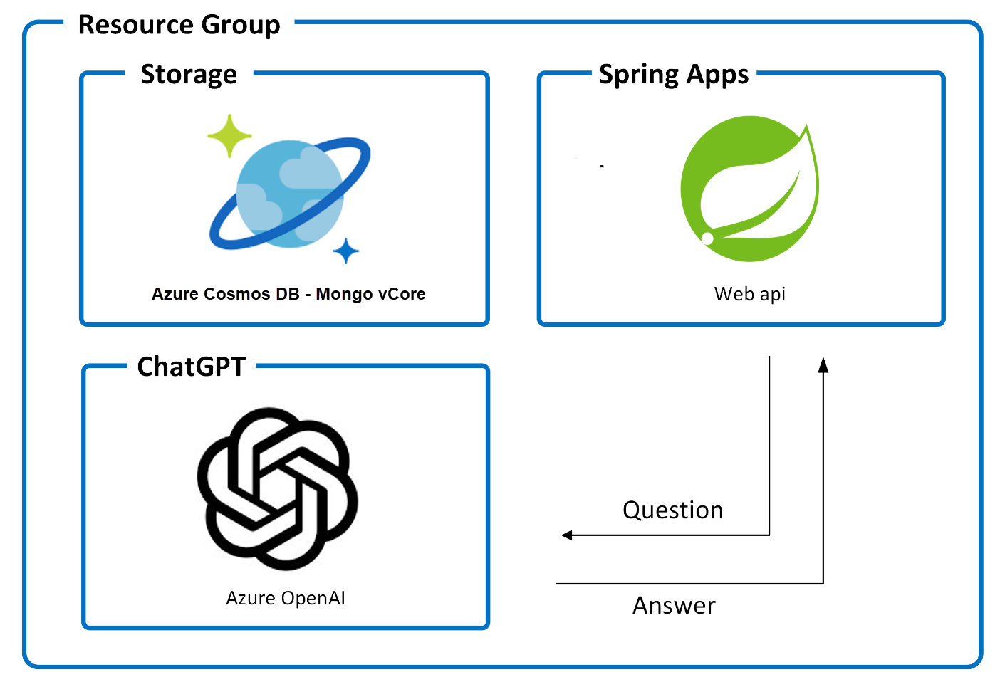
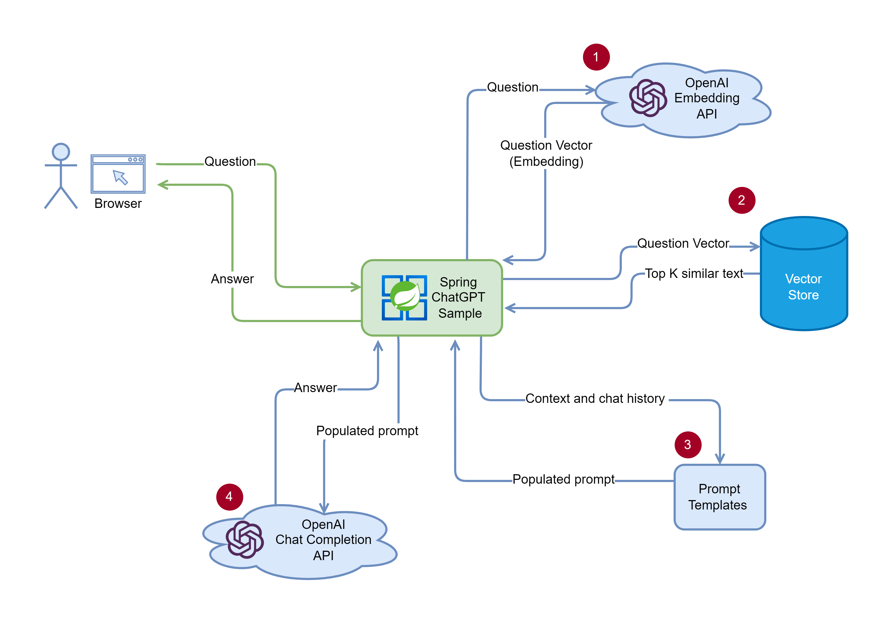

# Spring ChatGPT Sample with Azure Cosmos DB

This sample shows how to build a ChatGPT like application in Spring and run on Azure Spring Apps with Azure Cosmos DB. The vector store in Azure Cosmos DB enables ChatGPT to use your private data to answer the questions.

### Application Architecture

This application utilizes the following Azure resources:

- [**Azure Spring Apps**](https://docs.microsoft.com/azure/spring-apps/) to host the application
- [**Azure OpenAI**](https://docs.microsoft.com/azure/cognitive-services/openai/) for ChatGPT
- [**Azure Cosmos DB**](https://learn.microsoft.com/azure/cosmos-db/mongodb/vcore/) as the vector store database.

Here's a high level architecture diagram that illustrates these components.



## How it works



1. Indexing flow (CLI)
   1. Load private documents from your local disk.
   1. Split the text into chunks.
   1. Convert text chunks into embeddings
   1. Save the embeddings into Cosmos DB Vector Store
1. Query flow (Web API)
   1. Convert the user's query text to an embedding.
   1. Query Top-K nearest text chunks from the Cosmos DB vector store (by cosine similarity).
   1. Populate the prompt template with the chunks.
   1. Call to OpenAI text completion API.


## Getting Started

### Prerequisites

The following prerequisites are required to use this application. Please ensure that you have them all installed locally.

- [Git](http://git-scm.com/).
- [Java 17 or later](https://learn.microsoft.com/java/openjdk/install)
- [Azure Cosmos DB Mongo vCore account](https://docs.microsoft.com/azure/cosmos-db/mongodb/vcore/create-account)
- An Azure OpenAI account (see more [here](https://customervoice.microsoft.com/Pages/ResponsePage.aspx?id=v4j5cvGGr0GRqy180BHbR7en2Ais5pxKtso_Pz4b1_xUOFA5Qk1UWDRBMjg0WFhPMkIzTzhKQ1dWNyQlQCN0PWcu))

### Quickstart

1. git clone this repo.
2. Create the following `environment variables` with the appropriate values:

   ```shell
   set OPENAI_EMBEDDING_DEPLOYMENT_ID=<Your OpenAI embedding deployment id>
   set OPENAI_CHAT_DEPLOYMENT_ID=<Your Azure OpenAI chat deployment id>
   set OPENAI_ENDPOINT=<Your Azure OpenAI endpoint>
   set OPENAI_API_KEY=<Your Azure OpenAI API key>
   set COSMOSDB_DATABASE=<Choose any database name>
   set COSMOSDB_URI=<Cosmos DB Mongo vCore connection string>
   set COSMOSDB_USERNAME=<Username you created for your Cosmos DB Mongo vCore cluster>
   set COSMOSDB_PASSWORD=<Password you created for your Cosmos DB Mongo vCore cluster>
   ```

3. Build the application:

   ```shell
   mvn clean package
   ```  

4. The following command will read and process your own private text documents, create a Cosmos DB Mongo vCore collection with vector index, and load the processed documents into it:

   ```shell
      java -jar spring-chatgpt-sample-cli/target/spring-chatgpt-sample-cli-0.0.1-SNAPSHOT.jar --from=C:/<path you your private text docs>

   ```
   > Note: if you don't run the above to process your own documents, at first startup the application will read a pre-provided and pre-processed `vector-store.json` file in `private-data` folder, and load those documents into Cosmos DB instead.

5. Run the following command to build and run the application:

   ```shell
   java -jar spring-chatgpt-sample-webapi/target/spring-chatgpt-sample-webapi-0.0.1-SNAPSHOT.jar
   ```
6. Open your browser and navigate to `http://localhost:8080/`. You should see the below page. Test it out by typing in a question and clicking `Send`.

   

   <sup>Screenshot of the deployed chatgpt app</sup>